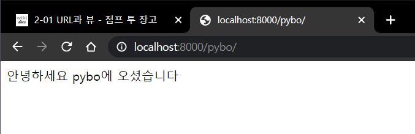
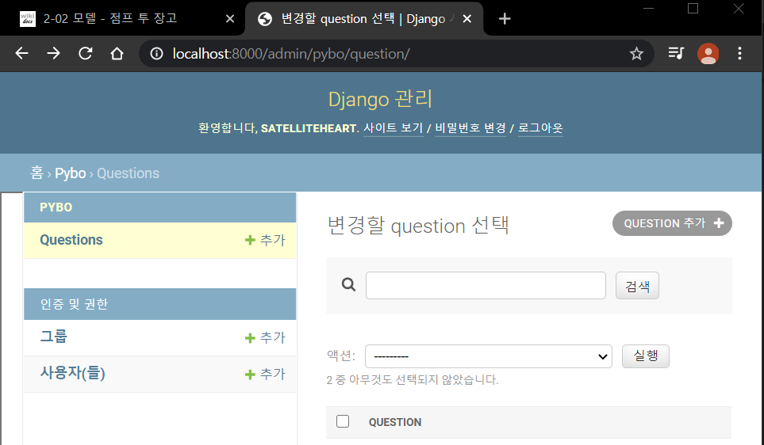
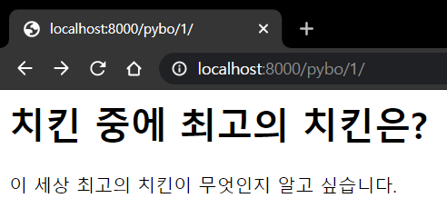
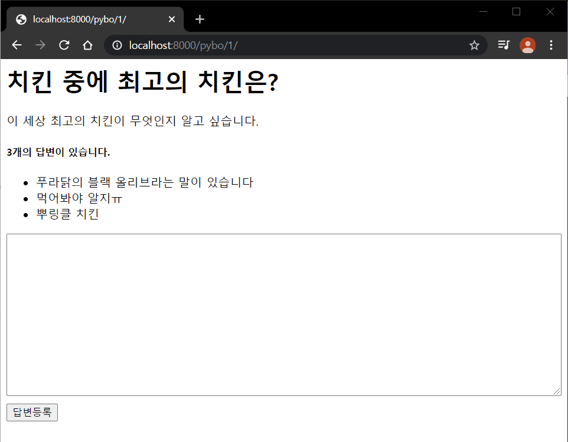

# 02장 장고 기초
참고 : https://wikidocs.net/73306

## URL과 뷰
* 장고의 urls.py 파일은 페이지 요청이 발생하면 가장 먼저 호출되는 파일로 URL과 뷰(views.py) 함수간의 매핑을 정의한다
* 장고에서 views.py를 뷰라고 부른다

\[../pybo/urls.py]
```python
from django.contrib import admin
from django.urls import path
from pybo import views              #pybo라는 라이브러리에서 가져와
urlpatterns = [
    path('admin/', admin.site.urls),
    path('pybo/', views.index),     #'pybo/'라는 path를 추가함
]
```
`pybo/`라는 URL이 요청되면 `views.index`를 호출하라는 매핑을 추가한 것이다.
여기서 `views.index`는 views.py라는 파일의 index함수를 의미한다

실제로 요청되는 URL은 `http://localhost:8000/pybo` 이지만 호스트명(localhost)과 포트(8000)가 생략된 URL인 `pybo/`로 매핑해야한다. 호스트명과 포트는 서버에 따라 바뀌기 때문

\[../pybo/views.py]
```python
from django.http import HttpResponse

def index(request):
    return HttpResponse("안녕하세요 pybo에 오셨습니다")
```
HttpResponse는 HTTP 요청에 대한 응답을 할 때 쓰는 장고 함수이다. index함수의 매개변수 `request`는 **장고 프레임워크에 의해 자동으로 전달되는 HTTP 요청 객체**이다.



### URL의 분리

```python
from django.contrib import admin
from django.urls import path, include

urlpatterns = [
    path('admin/', admin.site.urls),
    path('pybo/', include('pybo.urls')),
]
```
`include`를 통해 `/pybo` 이하의 디렉토리가 추가되더라도 `pybo/urls.py`만 수정해주면 된다!

## 모델

장고는 모델(Model)을 이용하여 데이터베이스를 처리한다. without SQL 쿼리문

[django로 블로그 model 만들기](https://velog.io/@hidaehyunlee/Django-%EB%B8%94%EB%A1%9C%EA%B7%B8-model-%EB%A7%8C%EB%93%A4%EA%B8%B0)

[장고 ORM과 쿼리셋](https://tutorial.djangogirls.org/ko/django_orm/)

[ORM?](https://medium.com/@jsh901220/django%EC%99%80-cookiecutter-django-%EA%B0%84%EB%8B%A8-%EC%84%A4%EB%AA%85-898d063d38ff)
    -> 객체의 관게를 연결해주는 것으로 객체 지향적인 방법을 사용하여 데이터베이스의 데이터를 쉽게 조작할 수 있게 해준다

\[models.py]
```python
from django.db import models


class Question(models.Model):
    # 제목은 최대 200자
    # 글자수가 제한된 텍스트는 CharField
    subject = models.CharField(max_length=200)
    # 글자수를 제한할 수 없는 텍스트는 TextField
    content = models.TextField()
    create_date = models.DateTimeField()


class Answer(models.Model):
    # ForeignKey는 다른 모델과의 연결
    # on_delete=models.CASCADE는 이 답변과 연결된 질문이 삭제될 경우 답변도 삭제된다는 뜻
    question = models.ForeignKey(Question, on_delete=models.CASCADE)
    content = models.TextField()
    create_date = models.DateTimeField()
```

* `ForeignKe`y는 다른 모델과의 연결
* `on_delete=models.CASCADE`는 이 답변과 연결된 질문이 삭제될 경우 답변도 삭제된다는 뜻

[filter을 통해 개발하기; 공식 사이트](https://docs.djangoproject.com/en/3.0/topics/db/queries/)

### 실습해보기
* `연결모델명_set`(
    여기서는 answer_set) 은 질문 하나에 여러개의 답변이 가능할 것이므로 q.answer_set이 가능하지만 답변 하나에는 여러개의 질문이 있을 수 없으므로 question_set은 불가능하다. 대신 a.question은 가능

## 슈퍼유저
장고의 장점; 장고 관리자(Admin)
`python manage.py createsuperuser`을 통해 슈퍼 유저를 생성한다.

### 모델 검색
`pybo/admin.py`을 다음과 같이 수정한다면

```python
class QuestionAdmin(admin.ModelAdmin):
    search_fields = ['subject']
    # subject를 기준으로 찾겠다


admin.site.register(Question, QuestionAdmin)
```

다음과 같이 검색 기능이 추가된 것을 확인할 수 있다



## 정리

\[모델 생성하기]

1. 장고를 통해 질문과 답변에 해당되는 모델을 정의한다(in pybo/models/py)
   ```python
   from django.db import models


    class Question(models.Model):
        subject = models.CharField(max_length=200)
        content = models.TextField()
        create_date = models.DateTimeField()


    class Answer(models.Model):
        question = models.ForeignKey(Question, on_delete=models.CASCADE)
        content = models.TextField()
        create_date = models.DateTimeField()
    ```

2. 작성한 모델을 이용하여 테이블을 생성한다
    1. `\[.\mysite\config\settings.py]` 안에 `pybo.apps.PyboCongif`를 추가한다

3. `makemigrations`을 통해 첫 migration을 실행한 후

4. `migrate`을 통해 모델을 생성한다 -> `python manage.py migrate`

> SQL언어를 통해 복잡하게 접근해야하는 방식과 달리 django를 통해 python 언어로 쉽게 자료에 접근할 수 있다

## 조회와 템플릿

```python
from django.shortcuts import render
from .models import Question


def index(request):
    # pybo 목록을 출력시킬 것임
    question_list = Question.objects.order_by('-create_date')
    # order_by는 조회 결과를 정렬하는 함수
    # -create_date하면 작성일시의 역순(-가 붙었기 때문)으로 정렬
    context = {"question_list": question_list}
    return render(request, 'pybo/question_list.html', context)
```
> 템플릿 파일을 상위 폴더로 두고 pybo의 템플릿 파일을 하위 폴더로 두자 -> 모든 앱의 템플릿을 관리하기에 용이하기 때문

```html
 
// question_list가 존재한다면
    <ul>
         
        //question_list안에 있는 요소를 하나씩 question에 대입하여 for문
            <li> <a href="/pybo/{{question.id}}/">{{question.subject}}</a> </li>
            //{{question.id}} : question 객체의 id번호를 출력하고
            //{{question.subject}} : question 객체의 제목을 출력
        
    </ul>

<p> 질문이 없습니다 </p>


```

### 템플릿 태그?

공식 사이트 : https://docs.djangoproject.com/en/3.0/topics/templates/
템플릿을 보면 `` 처럼 `` 로 둘러싸인 문장들을 볼 수 있는데 이러한 것들을 템플릿 태그라고 한다. `{% endfor% }`과 ``로 꼭 닫아주어야 한다는 것!!

`{{ 객체 }}`

## 상세 조회



> 제네릭뷰를 통해 목록조회나 상세조회를 간편하게 접근할 수 있지만 복잡한 케이스를 다루려고 할 때에는 더 어렵게 작성될 수 잇으므로 주의하여 사용하여야 한다

### URL 별칭
namespace를 통해 c++처럼 namespace로 다양한 library/data를 쓸 수 있게끔 한 것

URL별칭은 템플릿 외에 redirect 함수에서도 사용된다. 예) `redirect('pybo:detail', question_id=question.id)`

### 답변 등록 버튼
```html
<h1>{{ question.subject }}</h1>
<div>
    {{ question.content}}
</div>

<form action = "" method="post">
    
    <textarea name ="content" id="context" rows="15"></textarea>
    <input type = "submit" value ="답변등록">
</form>
```
``은 보안에 관련된 항목으로 form으로 전송한 data가 실제 웹페이지에서 작성된 데이터인지 판단하는 것. 그래서 form 태그 바로 밑에 위치한다

### 뷰함수 추가

```python
from django.shortcuts import render, get_object_or_404, redirect
from .models import Question
from django.utils import timezone

# index 함수는 위에서 정의

def detail(request, question_id):
    """
    pybo 내용 출력
    """
    question = get_object_or_404(Question, pk=question_id)
    context = {'question': question}
    return render(request, 'pybo/question_detail.html', context)

def answer_create(request, question_id):
    """
    pybo 답변등록
    """
    question = get_object_or_404(Question, pk=question_id)
    question.answer_set.create(content=request.POST.get('content'), create_date=timezone.now())
    return redirect('pybo:detail', question_id=question.id)
```

! Question과 Answer 모델은 서로 `ForeignKey`로 연결되어 있기 때문에 Answer모델을 이용해도 된다.

```python
question = get_object_or_404(Question, pk=question_id)
answer = Answer(question=question, content=request.POST.get('content'), create_date=timezone.now())
answer.save()
```

### 스태틱
스타일시트(stylesheet, CSS 파일)을 사용하여 화면에 디자인을 적용해야 한다

```html

<link rel="stylesheet" type="text/css" href="">
```

스타일시트와 같은 스태틱 파일을 사용하기 위해서는 템플릿 가장가리에 태그를 삽입해야 한다. 스타일 시트 경로 파일 속에서의 static은 스태틱 디렉터리를 파일에 등록해 주었으므로 static이라는 이름을 통해 접근 가능하다

