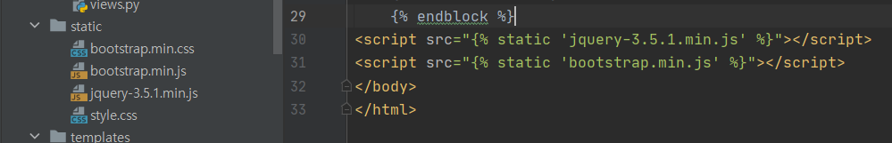

# 03장 장고 심화
참고 : https://wikidocs.net/72281

- [03장 장고 심화](#03장-장고-심화)
  - [네비게이션 바](#네비게이션-바)
    - [네비게이션 바](#네비게이션-바-1)
    - [include](#include)
    - [question_list](#question_list)
    - [장고 기능 개발 패턴](#장고-기능-개발-패턴)


## 네비게이션 바
### 네비게이션 바
참고 : https://getbootstrap.com/docs/4.4/components/navbar/

네비게이션 바는 **모든** 화면 상단에 항상 고정되어 있는 부트스트랩 컴포넌트이다
```html
<nav class ="navbar navbar-expand-lg navbar-light bg-light border-bottom">
    <a class ="navbar-brand" href="">Pybo</a>
    <button class = "navbar-toggler ml-auto" type="button"
            data-toggle="collapse" data-target="#navbarNav"
            aria-controls="navbarNav" aria-expanded="false"
            aria-label="Toggle navingation">
        <span class="navbar-toggler-icon"></span>
    </button>
    <div class ="collapse navbar-collapse flex-grow-0" id="navbarNav">
        <ul class="navbar-nav">
            <li class="nav-item">
                <a class="nav-link" href="#">로그인</a>
            </li>
        </ul>
    </div>
</nav>
```
애초에 `nav class`로 받는다. 부트스트랩 반응형 웹 기능중 하나로 작은 해상도에서는 모든 링크들이 작은 메뉴 버튼들로 보이게 한다 (오른쪽 상단의 석삼자)



코드 버전이 맞도록 입력해야 한다

### include
장고에는 템플릿의 특정 위치에 html 코드를 삽입할 수 있는 `include` 기능이 존재한다

### question_list
페이지의 무한한 스크롤을 막기 위해 한 페이지에서 보여지는 게시글을 제한하고 접근하기 위해 페이지 템플릿을 수정한다
간단한 for문을 통해 보여지는 페이지 표시 개수를 제한한다

`Paginator`의 도움으로 실행

```html
<ul class="pagination justify-content-center">
    <!-- 이전페이지 -->
    
    <li class="page-item">
        <a class="page-link" href="?page={{ question_list.previous_page_number }}">이전</a>
    </li>
    
    <li class="page-item disabled">
        <a class="page-link" tabindex="-1" aria-disabled="true" href="#">이전</a>
    </li>
    
    <!-- 페이지리스트 -->
    
    <!-- 현재 페이지에서 양쪽으로 5페이지 보이기 using by if -->
    
        
        <li class="page-item active" aria-current="page">
            <a class="page-link" href="?page={{ page_number }}">{{ page_number }}</a>
        </li>
        
        <li class="page-item">
            <a class="page-link" href="?page={{ page_number }}">{{ page_number }}</a>
        </li>
        
    
    
    <!-- 다음페이지 -->
    
    <li class="page-item">
        <a class="page-link" href="?page={{ question_list.next_page_number }}">다음</a>
    </li>
    
    <li class="page-item disabled">
        <a class="page-link" tabindex="-1" aria-disabled="true" href="#">다음</a>
    </li>
    
</ul>
```

페이지 번호 수정하는 공식 `전체 게시물 개수 - 시작 인덱스 - 현재 인덱스 + 1`을 이용해 일련번호를 수정한다.
```
{{ question_list.paginator.count|sub:question_list.start_index|sub:forloop.counter0|add:1 }}
```

전체 게시물을 세고 sub를 통해 시작 인덱스를 뺀다. forloop.counter0을 통해 루프 내의 현재 인덱스를 빼고 0부터 뺐으니 1을 더한다.


### 장고 기능 개발 패턴

1. 화면에 버튼 등 기능 추가하기
2. urls.py 파일에 기능에 해당하는 URL 매핑 추가하기
3. forms.py 파일에 폼 작성하기
4. views.py 파일에 URL 매핑에 추가한 함수 작성하기
5. 함수에서 사용할 템플릿 작성하기

